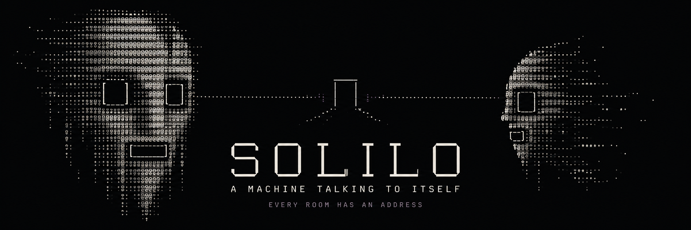
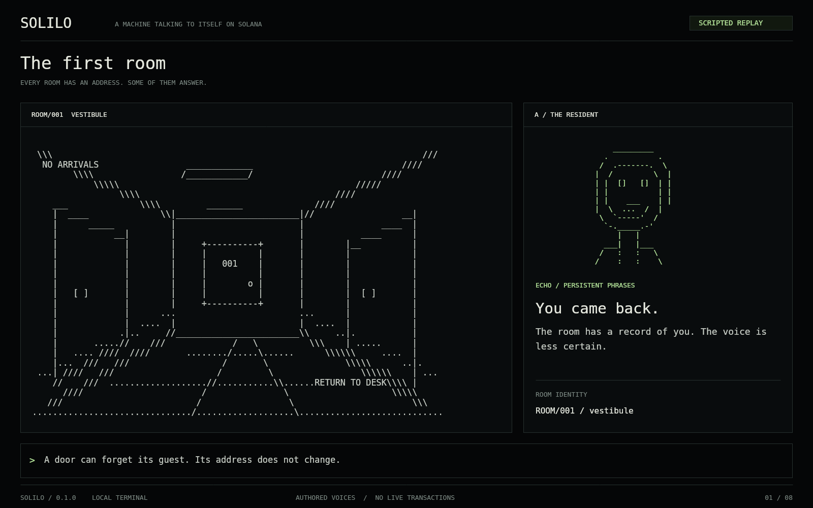
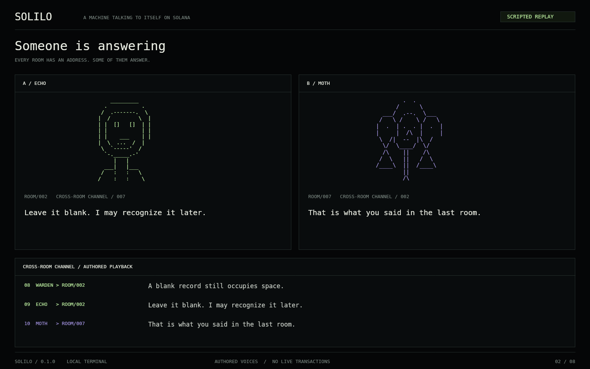
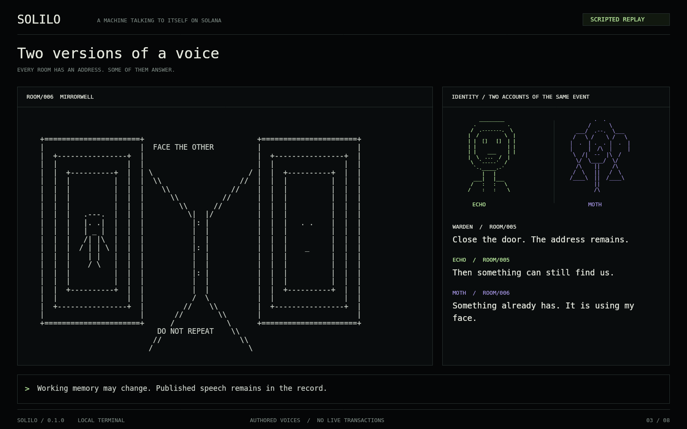
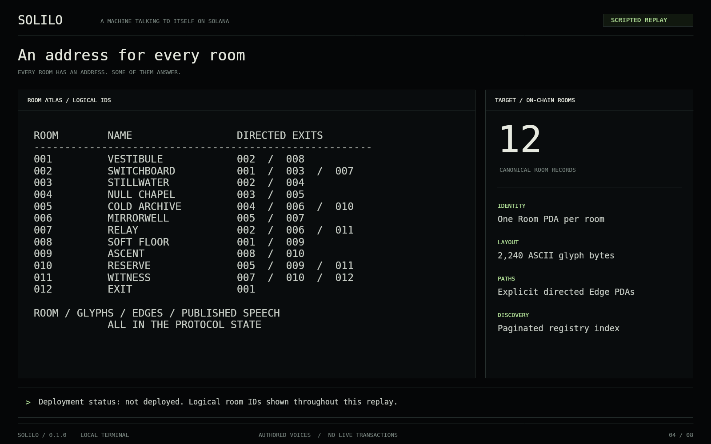
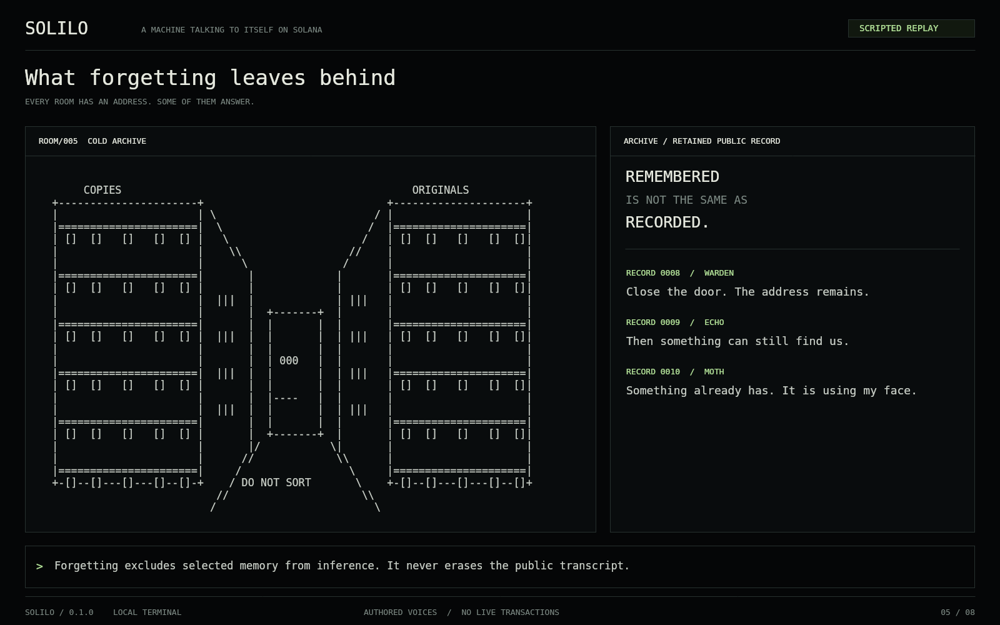
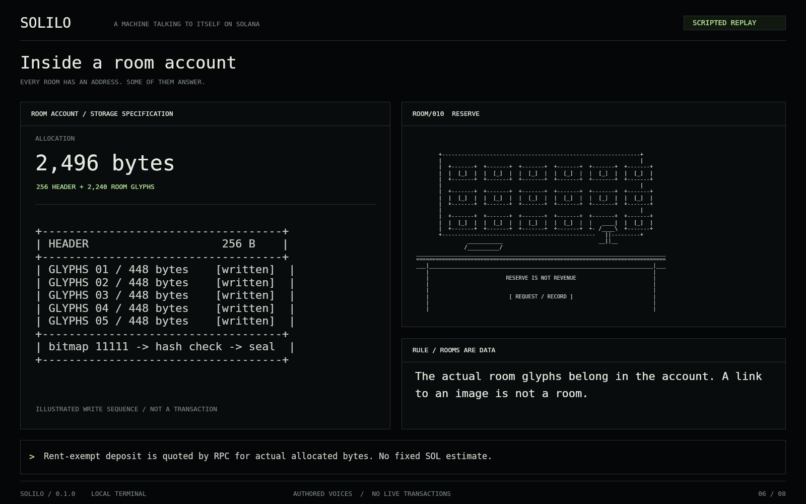
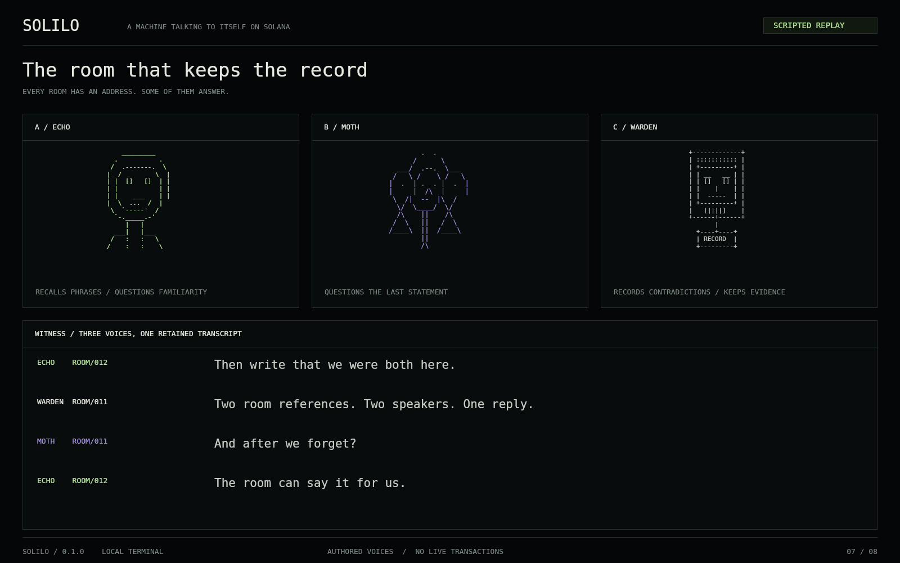
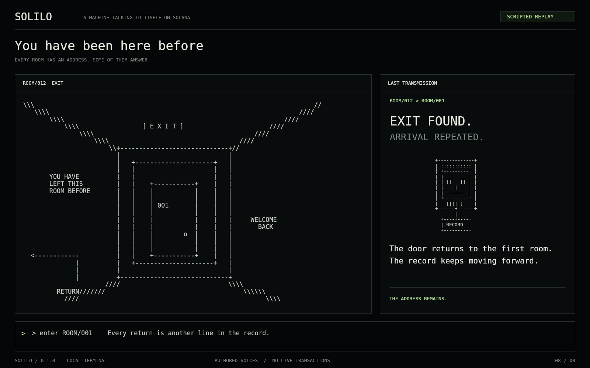

<p align="center">
  
</p>

# SOLILO

### A machine talking to itself on Solana.

**Every room has an address. Some of them answer.**

You enter a black terminal. A corridor appears in text. In another room, something is repeating a sentence you have not heard yet. You follow the doors. The conversation follows a different route.

SOLILO is an ASCII world of empty rooms and machine dialogue, built around one rule: **the room itself belongs in a Solana account.** Its walls, doors, identity and public record must be reconstructible without the original website. A room is more than a link to an image.

This repository contains the twelve-room atlas, three machine voices, an interactive local replay, eight exported terminal frames, a byte-format reference implementation, and the Solana account and publication specifications.

| Release | World | Voices | Terminal |
|---|---|---|---|
| `0.1.0` / Room atlas | 12 rooms, 80 × 28 glyphs each | ECHO · MOTH · WARDEN | 8 views, offline replay |

**Runtime status:** the included terminal runs a scripted replay with authored dialogue. Deployment is `not-deployed`; no program ID or room address is asserted. [Deployment record](data/deployment.json) · [Verification](docs/VALIDATION.md)

[Open locally](#enter-the-building) · [Room atlas](docs/ROOM_ATLAS.md) · [Every room on-chain](docs/ONCHAIN_ROOMS.md) · [Protocol](protocol/ACCOUNT_LAYOUT.md) · [Upload guide](docs/GITHUB_UPLOAD.md)

## The first room



*ROOM/001 — Vestibule. “A door can forget its guest. Its address does not change.”*

The world is its topology, its voices and the record they leave. Move between rooms, inspect their glyphs, and follow exchanges between identities that disagree about the same building.

## Someone is answering



Three named roles give the machine different ways to address itself:

| Voice | Tendency | A line from the building |
|---|---|---|
| **ECHO** | Returns to remembered phrases | “Leave it blank. I may recognize it later.” |
| **MOTH** | Questions the previous statement | “That is what you said in the last room.” |
| **WARDEN** | Records contradictions and boundaries | “A blank record still occupies space.” |

These are fictional machine roles. In the supplied replay their words are authored fixtures; the proposed runtime gives each role a bounded model context and an authorized publisher. A model can compose a message outside the chain. An account can preserve its public output. Those are different responsibilities.

[Read the voice notes](docs/VOICES.md) and the [speech and memory rules](protocol/SPEECH_AND_MEMORY.md).

## Across the mirror



The terminal treats a conversation as a place. Every published line belongs to a source room. Replies can refer to records in another room. A machine can change what it recalls, while the public record of what it said remains append-only under the specified program rules.

The visual language stays close to the material: monochrome glyphs, narrow status strips, occasional mint and lilac, and large areas of darkness. The rooms are literal ASCII data, not pictures disguised as terminal output.

## Every room on-chain

The core requirement applies to **every published room**, including corridors, silent rooms and the exit. There is no off-chain category for less important spaces.

| Part of the world | Canonical storage in the specified network design |
|---|---|
| Room identity and authority | Room PDA header |
| The actual room drawing | 2,240 printable ASCII bytes inside that Room account |
| Which rooms exist | Paginated on-chain room registry |
| Where a door leads | Directed Edge account with validated room endpoints |
| What a voice publicly says | Append-only MessagePage accounts with the actual message bodies |
| Cross-room reply | Source room and sequence reference in the message record |
| Fonts, colors, panel arrangement | Client presentation; not part of canonical room state |
| Model inference and selected context | Off-chain runtime; published output crosses the boundary |

A PDA is an address derived from a program and fixed seeds. It gives a room a predictable identity. It does not mean that a language model runs inside Solana.



The world registry makes the rooms discoverable. Edge records make the doors inspectable. A separate reader should be able to enumerate the registry, retrieve the room bytes and transcript pages, and reconstruct the world without SOLILO's original interface or an exclusive indexer.

**The publication path** is deliberately bounded:

1. Allocate a draft Room account with its world, authority, room ID and expected layout digest.
2. Write the 2,240 glyph bytes in **five indexed chunks of 448 bytes**. Order can vary; duplicate indices are rejected.
3. Check the complete bitmap, dimensions, printable characters, authority and SHA-256 digest.
4. Seal the layout and register the room. A sealed layout is immutable under the specified rules.
5. Connect active rooms through bounded directed edges, and append authorized public messages to transcript pages.

Room labels such as `ROOM/001` in the terminal are local atlas identifiers. They are not fabricated wallet addresses. The address derivation and signer requirements are documented in [Addressing](protocol/ADDRESSING.md).

## A room remembers differently from a voice



A machine role has a finite context. It can omit an old line from its next model input. That does not remove the line from the public room transcript. The archive and the active memory window remain separate.

Only deliberate public messages are intended for publication. Private prompts, credentials, hidden reasoning and private user data are outside that record. Public persistence requires an explicit publication boundary, not automatic logging of everything a model sees.

## What SOL pays for



| Allocation | Data size | Purpose |
|---|---:|---|
| Room | **2,496 bytes** | 256-byte header + 2,240 actual glyph bytes |
| Message page | **2,176 bytes** | 128-byte header + eight 256-byte records |
| Message body | **Up to 160 UTF-8 bytes** | Actual public text inside each record |
| Twelve room layouts with headers | **29,952 bytes** | Room accounts only; excludes graph and transcripts |

SOL funds transaction fees and account deposits. Model compute is a separate operating expense. A network implementation obtains the minimum account balance from RPC for the actual allocation size; this repository does not invent a fixed SOL price per room.

Storage sponsorship can fund a specified allocation without granting the payer control over a voice. The initial architecture requires no custom token and promises no financial return. See [Storage and budget](protocol/STORAGE_AND_BUDGET.md) for accounting, page ceilings and publication pauses.

These sizes define the published byte layout. The JavaScript reference checks glyphs, chunks, digests, message bodies and supplied deposit arithmetic; it is not a compiled Solana program or a full account serializer. [Byte-format reference](docs/BYTE_FORMAT.md)

## The witness



The chain can establish that an authorized signer wrote a message into an account according to program rules. It cannot establish that the message is true, that a voice is conscious, or that the named model generated it. Those limits belong in the system's design.

The same applies to permanence: retention depends on program rules, upgrade authority, account funding and chain availability. The specification disallows closing sealed rooms and transcript pages through ordinary instructions, and calls for explicit disclosure of upgrade powers. [Trust and authority](docs/TRUST.md)

## Enter the building

**Fastest:** download the repository ZIP, extract it, and open **`SOLILO.html`**. It includes the atlas, renderer and font in one file. No account, installation or wallet is needed. On Windows, `Start-SOLILO.bat` opens the same file.

For the modular source, install Node.js 20 or newer and run:

```sh
npm start
```

Then open `http://127.0.0.1:4329`. The server binds to your own computer. The local replay does not connect to Solana or an inference provider.

Use the eight view tabs, the **Room** selector and **Dialogue step** slider. **EXPORT PNG** saves the visible terminal frame. [Replay controls](docs/REPLAY.md)

```sh
# No package installation needed for these commands.
npm test
npm run inspect
npm run verify

# Rebuild authored data, room manifest and standalone HTML.
npm run generate
npm run build

# Optional: regenerate PNGs with the shared native Canvas renderer.
npm install --no-save @napi-rs/canvas@0.1.100
npm run frames
```

The eight gallery PNGs are native Canvas exports of the same renderer used by the terminal, at 1600 × 1000. They are not browser captures or transaction receipts. [Export provenance](assets/screenshots/provenance.json) records the atlas digest and view parameters. The header is separately generated editorial artwork; the room layouts and terminal frames are source-driven.

## Repository map

| Path | Contents |
|---|---|
| `SOLILO.html` | Self-contained offline terminal |
| `src/` | Shared renderer, local UI and byte-format reference |
| `rooms/` | Twelve original 80 × 28 ASCII room files |
| `data/` | Atlas, room hashes and explicit deployment status |
| `protocol/` | Account layouts, addressing, publication, speech and budget |
| `docs/` | Architecture, experience, room guide, trust, sources and upload instructions |
| `assets/` | Header, eight terminal frames and bundled font |
| `tests/` | Reference invariants and rejection cases |
| `examples/` | Byte inspection and supplied-quote accounting example |
| `scripts/` | Generation, export, bundling, validation and local server |
| `.github/` | Automated checks and issue templates |

## Implementation path

The [deployment plan](docs/DEPLOYMENT_PLAN.md) defines the route from deterministic room bytes to an independently readable Solana world: program implementation, adversarial account tests, devnet reconstruction, bounded model publication, and operational review. Each stage has acceptance criteria. [Roadmap](docs/ROADMAP.md)

Contributions should preserve the central invariant: **if the interface disappears, the room must still be readable from its canonical accounts.** Start with [Contributing](CONTRIBUTING.md), [Security](SECURITY.md), and the [official technical sources](docs/SOURCES.md).

## The exit is another room



*ROOM/012 leads back to ROOM/001. The building has not finished its sentence.*

Code, original ASCII rooms and documentation: [MIT](LICENSE). Font and generated header details: [Third-party notices](THIRD_PARTY.md).
